# Tac – E-Commerce Web Application
Website: https://tac-shop-940893129818.herokuapp.com/

Tac is a full-stack Django e-commerce website built to sell equestrian and horse accessories.  
The project focuses on clean UI, structured backend logic, and real-world e-commerce features including authentication, product management, shopping bag functionality, and secure checkout.

## Project Goals

The site is designed to be usable, accessible, and maintainable, with admin functionality allowing full control over products and categories whilst giving the customer a great shopping experience with fast search functionality and reponsive design.

## User Stories

1. As a first time user I want to be able to create an account and log in to keep track of my orders.
2. As a first time user I want to see what products I have in my shopping basket. 
3. As a first timer user I want to be notified of any product promotions or deals on.
4. As a Returing user I want to see my previous orders. 
5. As a User I want to be able to pay for my products easily. 
6. As a User I want to be able to save my address information.

## Design

[Coolers was used for my palette](https://coolors.co/)

I chose a greene theme for my project that has a nice contrasting gold or black text colour depending on the content.

## Wireframes
[Wireframe.cc was used to create my wireframes]([https://coolors.co/](https://wireframe.cc/))

#### Desktop

#### Mobile

---

### Products

#### Desktop

#### Mobile

---

### Checkout

#### Desktop

#### Mobile

---

### Accounts

#### Desktop

#### Mobile

---

### Profile

#### Desktop

#### Mobile

## Features

### General Use

Users can browse the full product catalogue with ease, viewing all available products in a clean, responsive layout.

Products can be filtered by category, sorted by price, rating, name, or category, and searched by name or description to quickly find specific items.

Each product has its own detail page where users can view images, descriptions, pricing, ratings, and category information before making a purchase.

Users can add products to their shopping bag, adjust quantities, or remove items entirely, with real-time feedback provided through on-screen notifications.

A secure checkout system powered by Stripe allows users to safely complete purchases using card payments.

---

### Account Management

Users can create an account or sign in through a combined login and registration page, providing a simple and streamlined experience.

Authenticated users can log out via a confirmation page to prevent accidental sign-outs.

Registered users have access to a profile page where they can view previous orders and saved delivery information.

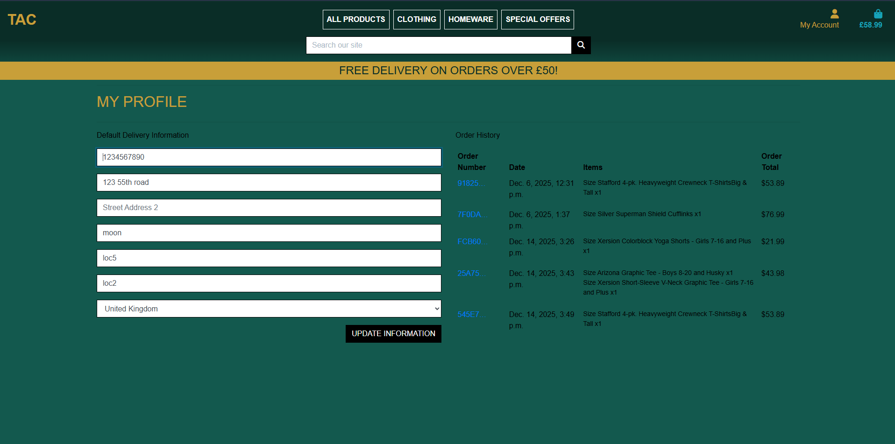

---

### Admin Functionality

Site administrators can add new products directly through the site, including pricing, descriptions, images, ratings, and category assignments.

Existing products can be edited or deleted, with confirmation prompts in place to prevent accidental data loss.

Administrators can create, update, or remove product categories, allowing the store structure to evolve as new products are added.

An admin-only list view is available to make product management easier, providing a clear overview of all products in a table format.

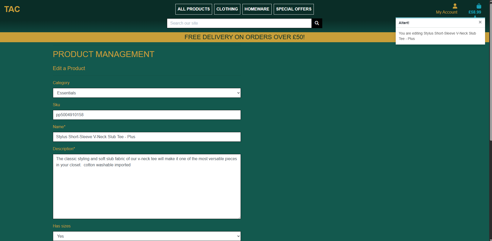

## Testing

### Manual Testing

Manual Testing is the user/programmer checking code visually and comparing it to the results of the visual product. Check if buttons/links work, making sure code is outputting the correct response.

#### When manually testing was used the following was found

- All Links Work taking you to correct webpage.
- Tested toast alerts and notifications.
- Checked resolution sizes and all webpages respond well to screen size.
- Checked stripe payment, when processing payment button is disabled to stop constant use.
- Checked admin view compared to normal user view to see if admin functionality works.
- Checked Adding and removing products from basket.
- Made sure creating an account sends an authetification link to email.
- Checked Stripe sends webhook and confirms payment

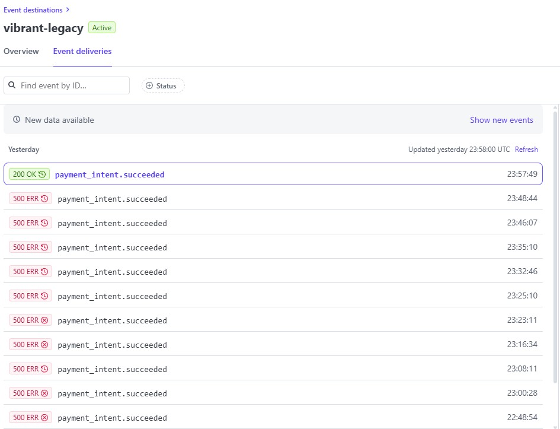

#### When manualy testing these flaws/bugs we're discovered

-Even though page would go through the correct motions using stripe the webhook was not being recieved, this was due to a conflict in packages and was ammened with an updated verion.
-The product delete modal had an issue where it wouldnt use the "confirm delete?" and would just delete the product straight away, the modal was ammended to allow for a popup to stop the user befor permenantly deleting the product.
-Image alt text not updating or being completely empty when changing it in the admin edit page. Added a default value and changed the html to reference the correct data.

#### Future additions

I would like to add a favourites app where the user can view all of their favourite products and be notified by email if they have come on sale.
I would also like to add a discout coupons section on the checkout page.

### Automated Testing

Automated Testing is the use of external software to check for errors in the code and to highlight them to be addressed.

#### Html
W3C markup was used to validate my html and as shown it passed. The errors shown are due to django code and not html

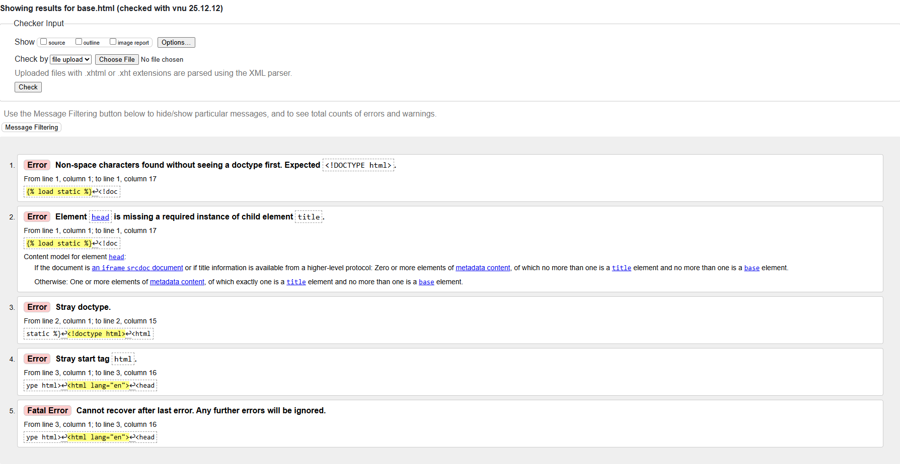

#### CSS

W3 Jigsaw was used to check the css used in my project and has passed with no issues.

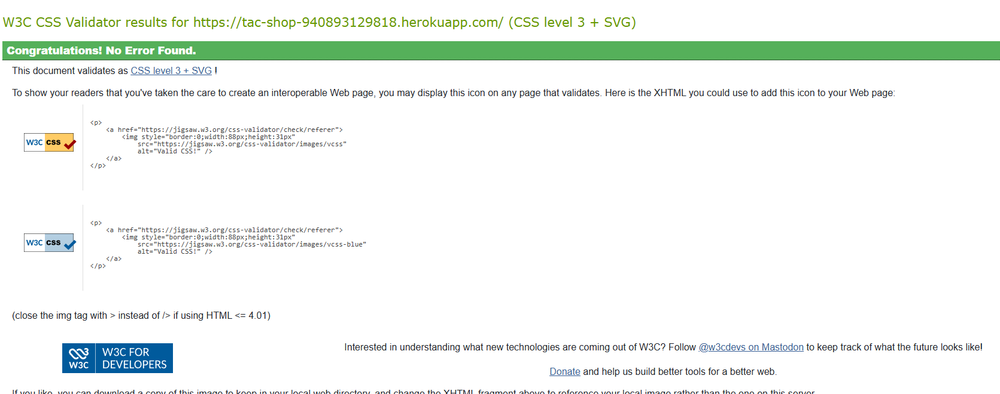

#### Lighthouse

Lighthouse was used to test the load times, accessibility and practices. As you can see it passed with a slight weakness in performance but still acceptable.

#### Java Script

I used es lint and Js Hint to validate my javascript
[JS Hint](https://jshint.com/)
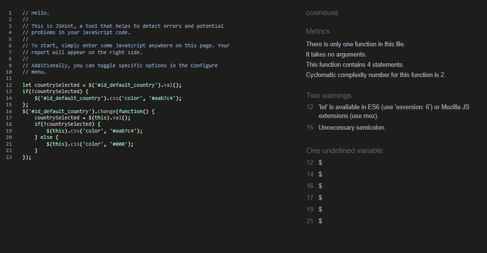

#### Git

Github notified me that some of my secret/gitignore files we're visable to the frontend due to cached data.
The data was forcably removed and secret keys got rotated for security measures.
After this functions using secrets got re-tested and checked for functionality.
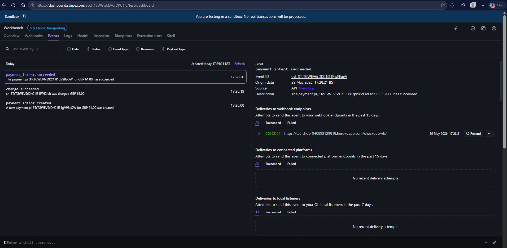

### User Stories Testing

As a first time user I want to be able to create and account to keep track of my orders. This is done with a clear login/register button at the top right of the screen that redirects the user to a singup page.
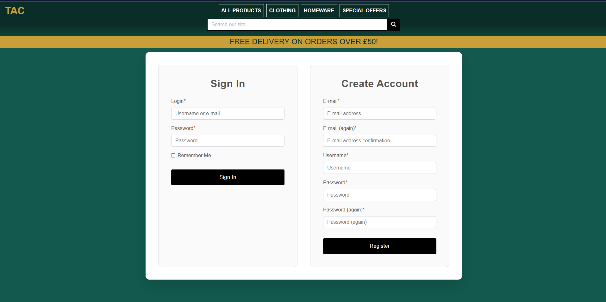
As a first time user I want to see what products I have in my shopping basket. The website has a small basket updater that shows what products are in your bag when you add an item in the top right or when pressing the basket symbol the user is redirected to a deidcated basket screen.
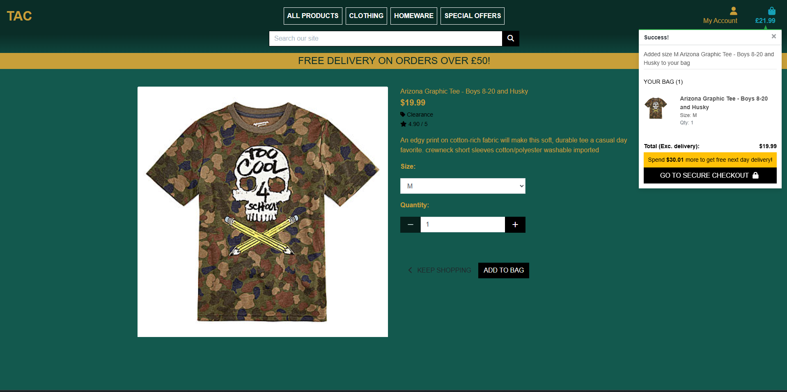
As a first timer user I want to be notified of any product promotions or deals on. The webpage displays a banner in the top notifying customers of a delivery deal where if they spend £50 they get delivery free.
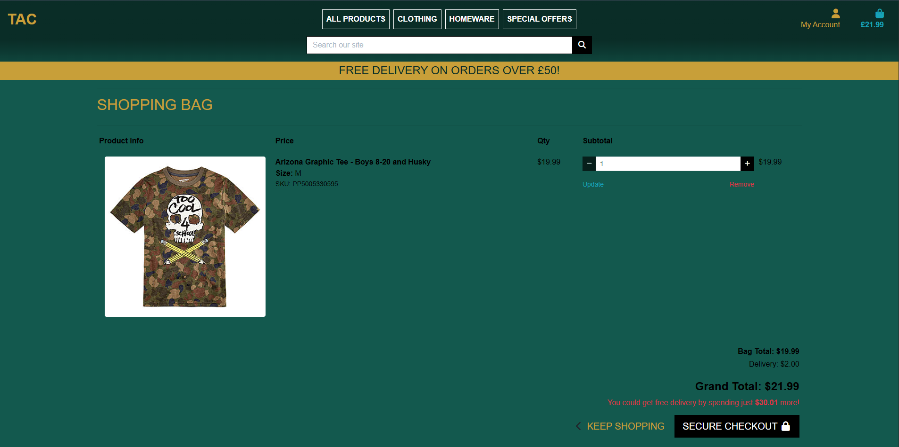
As a Returing user I want to see my previous orders. Once the user has logged in they have the option to review past orders using the unique order reference.

As a User I want to be able to pay for my products easily. The Webpage features a payment app that allows the user to input their bank details into stripe allowing for ease of pay.
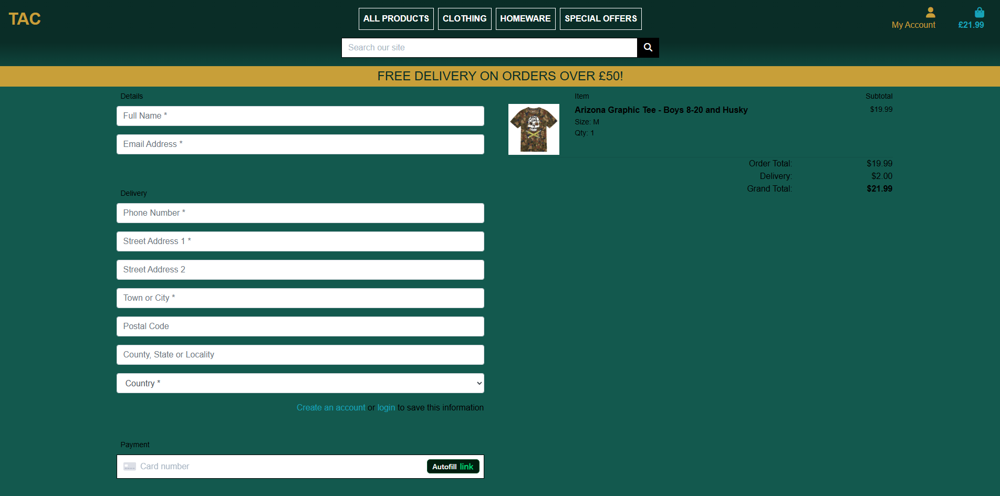
As a User I want to be able to save my address information. The webpage has its very own user details page where the user can save delivery details and will be automatically pulled when paying.

#### Deployment

The project is deployed using heroku and has it's product enviroment managed by it.

#### Database

The project uses PostgreSQL for the database, configured through Heroku.

#### Environment Variables

Current variables are as follows

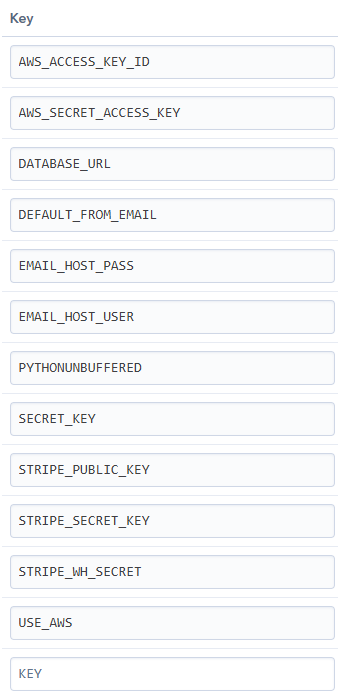

#### Stripe

Stripe was used to handle the payment/checkout page.
As seen above STRIPE_PUBLIC_KEY, STRIPE_SECRET_KEY, STRIPE_WH_SECRET are used to configure the secure payment.

#### AWS

AWS S3 was used to host my media files

-Creating an S3 bucket
-Setting bucket permissions and CORS configuration
-Connecting Django to AWS
-Using environment variables for AWS credentials

This allowed me to store and serve media files including css,js and images in production.

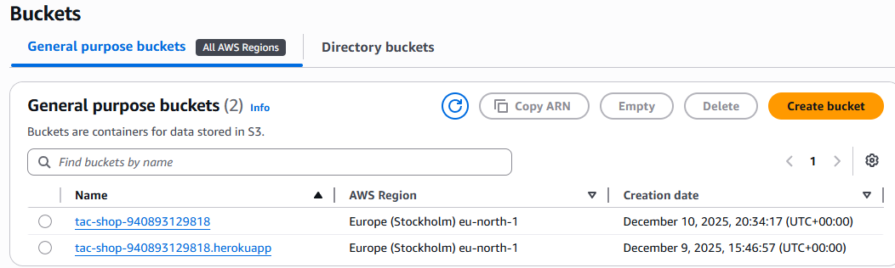
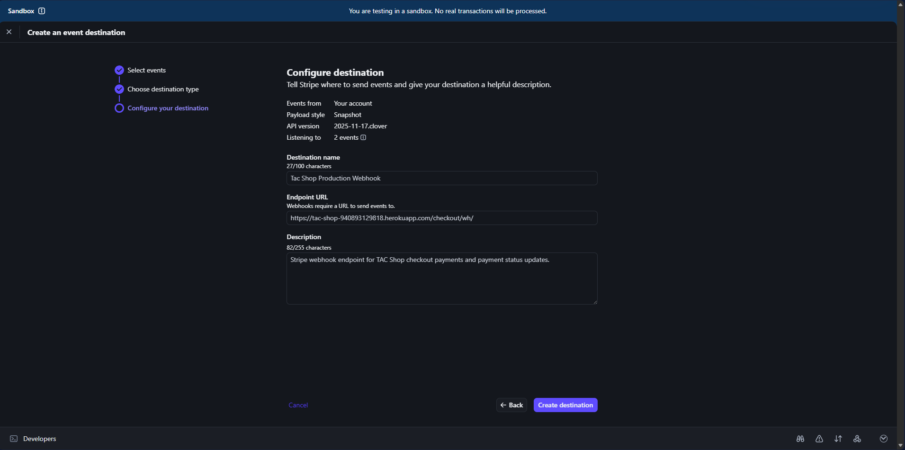

#### Deployment Steps

To deploy locally or to Heroku:

Install dependencies:
pip install -r requirements.txt
Run migrations:
python manage.py migrate
Collect static files:
python manage.py collectstatic
Create a superuser:
python manage.py createsuperuser
Push to GitHub and connect repository to Heroku.
Set environment variables in Heroku Config Vars.
Deploy the application.

#### Final Deployed Checks

The following checks were completed after deployment:

Verified successful Heroku build
Confirmed PostgreSQL database connection
Checked AWS S3 static and media file delivery
Tested Stripe payments successfully
Verified Stripe webhook responses
Confirmed account registration and login functionality
Checked admin product management
Tested product CRUD functionality
Verified responsive design across devices
Ran final manual testing on all major user journeys

#### How to fork

To fork the Essex Pc's repository:

-Log in (or sign up) to Github.
-Go to the repository for this project, HTTPS://github.com/Howlerloud/Tac.
-Click the Fork button in the top right corner.

#### How to Clone
To clone the Essex-Pc-s repository:

Log in (or sign up) to GitHub.
- Go to the repository for this project, HTTPS://github.com/Howlerloud/Tac.
- Click on the code button, select whether you would like to clone with HTTPS, SSH or GitHub CLI and copy the link shown.
- Open the terminal in your code editor and change the current working directory to the location you want to use for the cloned directory.
- Type 'git clone' into the terminal and then paste the link you copied in step 3. Press enter.

#### Credits

- https://www.w3schools.com/js/js_htmldom_css.asp helping with styling of text using js.
- W3 Schools helped with a lot of js structure.
- Media used was self taken
- Code institute

