# Tac – E-Commerce Web Application

Tac is a full-stack Django e-commerce website built to sell equestrian and horse accessories.  
The project focuses on clean UI, structured backend logic, and real-world e-commerce features including authentication, product management, shopping bag functionality, and secure checkout.

## Project Goals

The site is designed to be usable, accessible, and maintainable, with admin functionality allowing full control over products and categories whilst giving the customer a great shopping experience with fast search functionality and reponsive design.

## User Stories

1. As a first time user I want to be able to create and account to keep track of my orders. This is done with a clear login/register button at the top right of the screen that redirects the user to a singup page.
2. As a first time user I want to see what products I have in my shopping basket. The website has a small basket updater that shows what products are in your bag when you add an item in the top right or when pressing the basket symbol the user is redirected to a deidcated basket screen.
3. As a first timer user I want to be notified of any product promotions or deals on. The webpage displays a banner in the top notifying customers of a delivery deal where if they spend £50 they get delivery free.
4. As a Returing user I want to see my previous orders. Once the user has logged in they have the option to review past orders using the unique order reference.
5. As a User I want to be able to pay for my products easily. The Webpage features a payment app that allows the user to input their bank details into stripe allowing for ease of pay.
6. As a User I want to be able to save my address information. The webpage has its very own user details page where the user can save delivery details and will be automatically pulled when paying.

## Index

- [Design](#Design)
- [Wireframes](#Wireframes)
- [Features](#features)
- [Technologies Used](#technologies-used)
- [Database Design](#database-design)
- [Security Features](#security-features)
- [Testing](#testing)
- [Deployment](#deployment)
- [Credits](#credits)

## Design
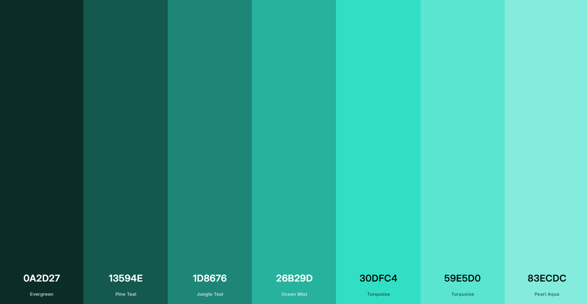

[Coolers was used for my palette](https://coolors.co/)

I chose a greene theme for my project that has a nice contrasting gold or black text colour depending on the content.

## Wireframes
[Wireframe.cc was used to create my wireframes]([https://coolors.co/](https://wireframe.cc/))

#### Desktop
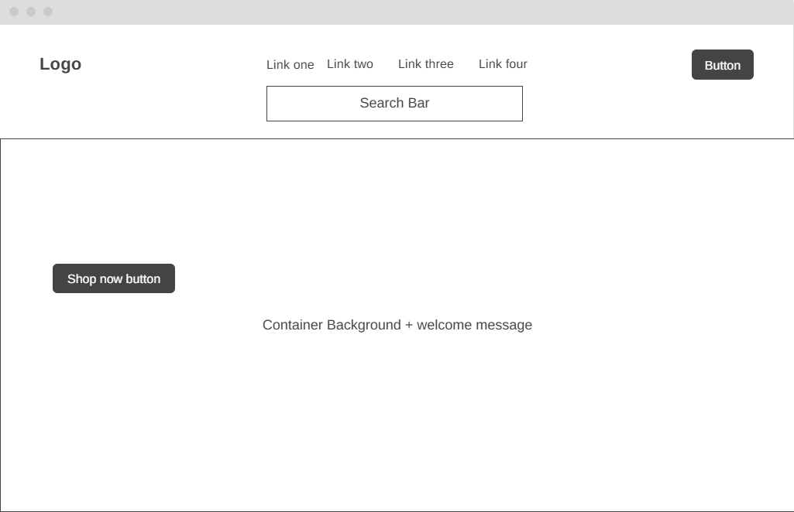

#### Mobile
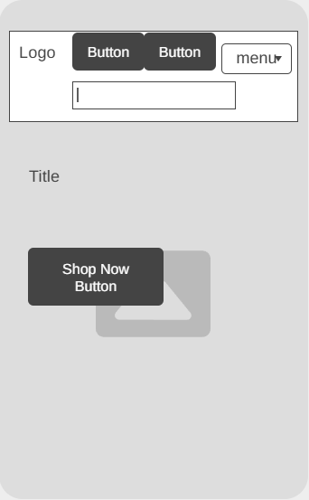

---

### Products

#### Desktop
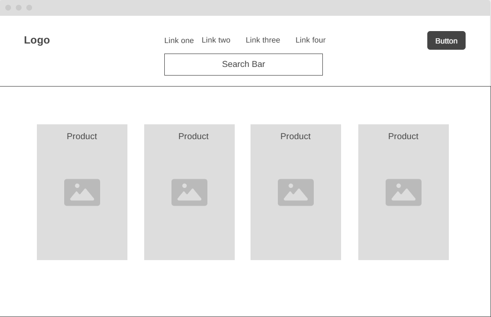

#### Mobile
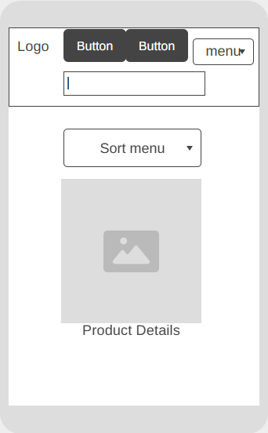

---

### Checkout

#### Desktop
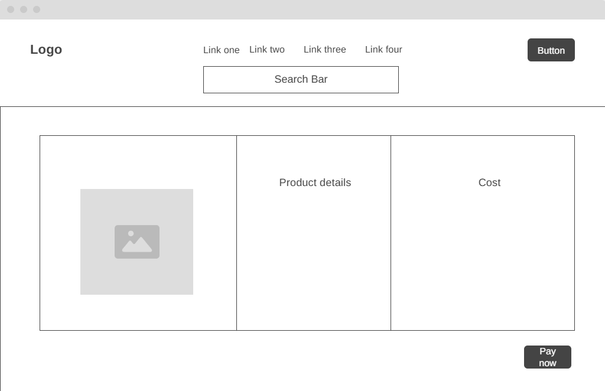

#### Mobile
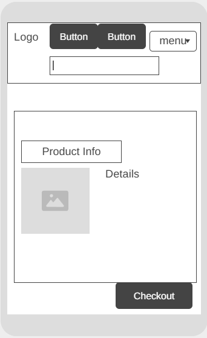

---

### Accounts

#### Desktop
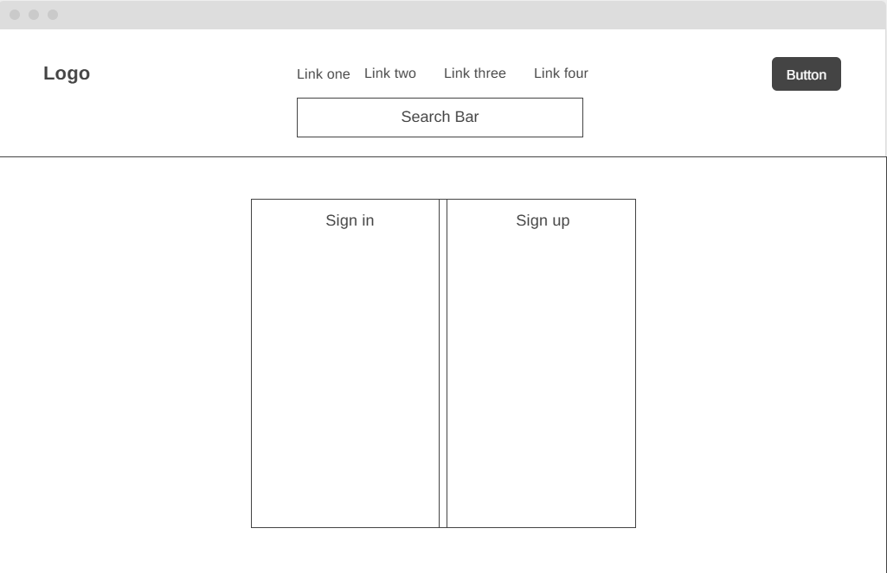

#### Mobile
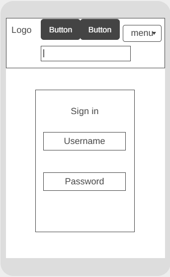

---

### Profile

#### Desktop
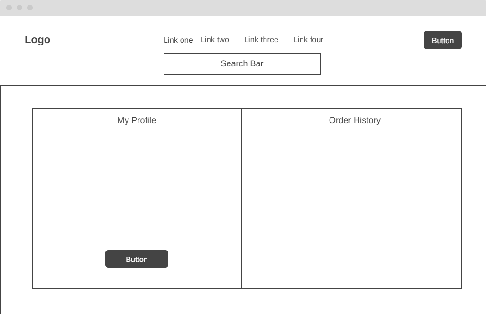

#### Mobile
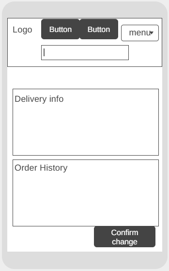

## Features

### General Use

Users can browse the full product catalogue with ease, viewing all available products in a clean, responsive layout.

Products can be filtered by category, sorted by price, rating, name, or category, and searched by name or description to quickly find specific items.

Each product has its own detail page where users can view images, descriptions, pricing, ratings, and category information before making a purchase.

Users can add products to their shopping bag, adjust quantities, or remove items entirely, with real-time feedback provided through on-screen notifications.

A secure checkout system powered by Stripe allows users to safely complete purchases using card payments.

---

### Account Management

Users can create an account or sign in through a combined login and registration page, providing a simple and streamlined experience.

Authenticated users can log out via a confirmation page to prevent accidental sign-outs.

Registered users have access to a profile page where they can view previous orders and saved delivery information.

---

### Admin Functionality

Site administrators can add new products directly through the site, including pricing, descriptions, images, ratings, and category assignments.

Existing products can be edited or deleted, with confirmation prompts in place to prevent accidental data loss.

Administrators can create, update, or remove product categories, allowing the store structure to evolve as new products are added.

An admin-only list view is available to make product management easier, providing a clear overview of all products in a table format.
